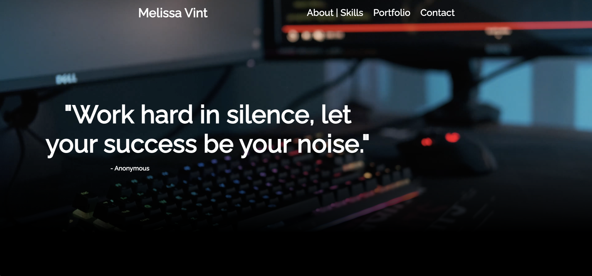
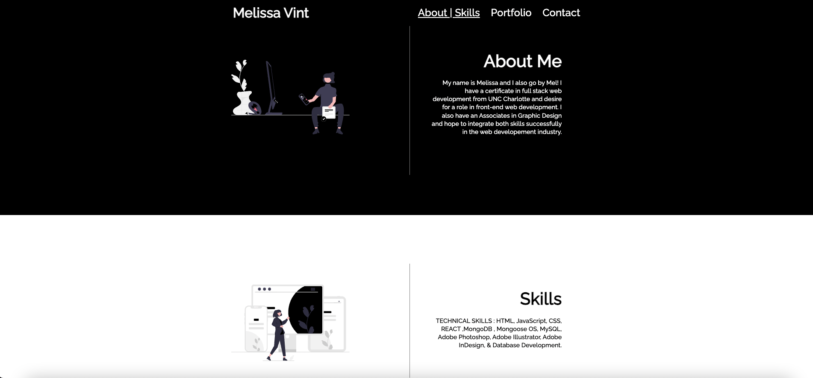

# PortfolioVint

For my portfolio I challeneged myself by building it with REACT. The majority of the code is Javascript and a tiny portion of some CSS. 

## Table of Contents

  - [Table of Contents](#table-of-contents)
  - [Usage](#usage)
  - [Features](#features)
  - [License](#license)
  - [Contributing](#contributing)
  - [Screenshots](#screenshots)
  - [Questions](#questions)

## Usage
1. Run `npm start` to start the application
2. Scan the portfolio site for each topic ( About Me/ Skills/ and Contact info.)
3. To reach contact info a double click is needed.
4. Once the user has reached the contact page they are free to send me and email if interested in services provided by me.

The Live link of the application is available at:  [Live Site Here!](https://pure-lowlands-02728.herokuapp.com/)
## Features
* Responsive scroll
* Active Features
* Viewing Routes
* Sending an email
* Browse through work.

## License
This project uses the MIT license
## Contributing
Pull requests are welcome
## Screenshots
**Home Page**
## Screenshots

## Questions
Checkout my GitHub [profile](https://github.com/mvint2647)

Please feel free to email at: <Melissavinny1133@gmail.com>

